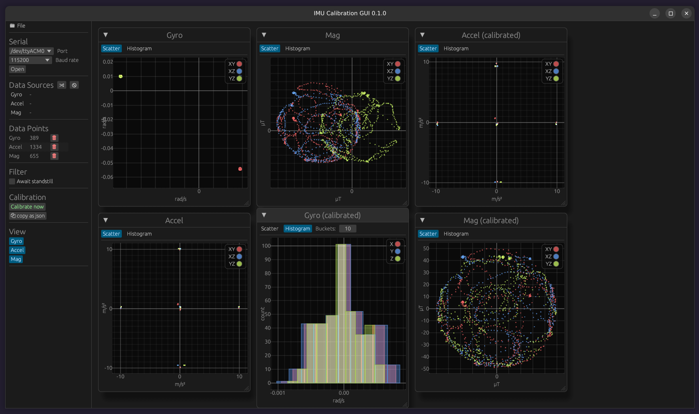

# IMU Calibration GUI

This is a simple GUI that helps you calibrate your IMU (accelerometer, gyroscope and magnetometer) and visualize the measurements before and after calibration.



## Features

* Gyro offset calibration
* Accelerometer offset and scale calibration
* Magnetometer soft- and hard-iron calibration
* Interactive plots (scatter and histogram)
* Save and load measurements (json) [*]
* Data providers
    * ROS2
    * Serial port

[*] Some example measurements are provided in the `test_files` folder.

## How to run?

The data provider is selected at compile time. You may chose to use the ROS2 **or** serial data provider.

### ROS2 Data Provider

The ROS2 data provider requires a working ROS2 setup (Foxy or more recent).
Make sure your ROS install is sourced, then run:

```
git clone https://github.com/krepa098/imu_cal_gui.git
cd imu_cal_gui
cargo r --release
```

#### ROS Topics

Data is received from the following ROS topics and follows the conventions described in their respective message definitions:
* `/imu` of type [sensor_msgs/msg/Imu](https://docs.ros2.org/foxy/api/sensor_msgs/msg/Imu.html)
* `/mag` of type [sensor_msgs/msg/MagneticField](https://docs.ros2.org/foxy/api/sensor_msgs/msg/MagneticField.html)


### Serial Port Data Provider

The serial data provider receives its data via the serial port (e.g, from an Arduino).

Run:

```
git clone https://github.com/krepa098/imu_cal_gui.git
cd imu_cal_gui
cargo r --release --no-default-features
```

#### Serial Data Format

The serial data is required to be formatted as follows:

```
mag %f %f %f\n
imu %f %f %f %f %f %f\n
```

e.g.,

```
mag -32.556152 26.770020 -74.780273
imu 2.502441 2.868652 1.831055 0.009644 0.004761 0.991821
```

where each value designates

```
mag <field_x> <field_y> <field_z>
imu <gyro_x> <gyro_y> <gyro_z> <acc_x> <acc_y> <acc_z>
```


## Acknowledgements

* The magnetometer calibration code is in part based on `nliaudat`'s Python implementation found [here](https://github.com/nliaudat/magnetometer_calibration).
* `TESLABS` magnetometer calibration guide found [here](https://teslabs.com/articles/magnetometer-calibration/)

## License

MIT